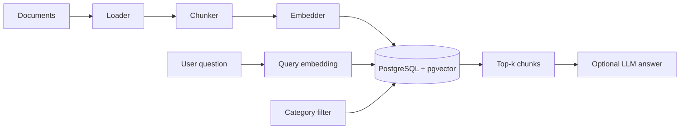

# pgvector RAG Demo

[](https://pgvector-rag-demo.onrender.com/)

A Retrieval-Augmented Generation (RAG) demo using **PostgreSQL + pgvector** for vector search, **sentence-transformers** for local embeddings, and a **Streamlit UI** for chat-based Q&A.

## What it does

1. Starts PostgreSQL with the pgvector extension (Docker)
2. Ingests `.txt`, `.md`, and `.pdf` documents → chunks → embeddings → Postgres
3. Retrieves the most relevant chunks for a question
4. Supports **metadata filtering** by document category
5. Optionally generates an answer with OpenAI if `OPENAI_API_KEY` is set
6. Provides a **Streamlit chat UI** with file upload and source citations

## Prerequisites

- Docker Desktop (or Docker Engine + Compose)
- Python 3.10+

## Quick start

```bash
# 1. Start Postgres with pgvector
docker compose up -d

# 2. Create a virtual environment and install dependencies
python3 -m venv .venv
source .venv/bin/activate
pip install -r requirements.txt

# 3. Configure environment
cp .env.example .env

# 4. Initialize schema and ingest sample docs
python main.py init-db
python main.py ingest data/sample_docs --category tutorials

# 5. Launch the web UI
python main.py ui
# or: streamlit run app.py

# 6. Or use the CLI
python main.py search "What is pgvector used for?"
python main.py search "What is pgvector used for?" --category tutorials
python main.py ask "How does RAG reduce hallucination?"
```

## Web UI

The Streamlit app includes:

- Chat interface with retrieved source citations
- File upload for `.txt`, `.md`, and `.pdf`
- Category tagging at ingest time
- Category filter dropdown for scoped retrieval
- Document/chunk counts and retrieval tuning

```bash
streamlit run app.py
```

Open [http://localhost:8501](http://localhost:8501).

## Live demo (portfolio)

Full stack on one URL: **Postgres + pgvector + Streamlit** with sample docs pre-ingested:

**[pgvector-rag-demo.onrender.com](https://pgvector-rag-demo.onrender.com/)**

Deploy via Render Blueprint (`render.yaml`). First boot ingests `data/sample_docs` and loads the embedding model (~1–2 min on free tier). Health: `GET /_stcore/health`.

Retrieval works without an API key. Set `OPENAI_API_KEY` on Render only if you want LLM-generated answers in the UI.

## CLI commands

| Command | Description |
|---------|-------------|
| `python main.py init-db` | Create tables and pgvector index |
| `python main.py ingest <path> [--category NAME]` | Ingest files or a directory |
| `python main.py search "<question>" [--category NAME]` | Show top matching chunks |
| `python main.py ask "<question>" [--category NAME]` | Retrieve context and optionally generate an answer |
| `python main.py ui` | Launch the Streamlit app |

## Supported file types

| Type | Extension | Notes |
|------|-----------|-------|
| Text | `.txt` | Plain UTF-8 text |
| Markdown | `.md` | Stored and chunked as text |
| PDF | `.pdf` | Text extracted with `pypdf` |

## Metadata filtering

Each document is tagged with a **category** at ingest time:

```bash
python main.py ingest data/sample_docs --category tutorials
python main.py ingest reports/ --category finance
```

When ingesting a directory, files in subfolders inherit the subfolder name as their category unless you pass `--category`.

Filter retrieval in the CLI or UI:

```bash
python main.py ask "Summarize pgvector" --category tutorials
```

## Project structure

```
.
├── app.py                  # Streamlit web UI
├── docker-compose.yml      # Postgres + pgvector
├── main.py                 # CLI entry point
├── requirements.txt
├── data/sample_docs/       # Sample knowledge base
└── src/
    ├── config.py           # Environment settings
    ├── db.py               # Schema + connection
    ├── loaders.py          # txt/md/pdf loading
    ├── chunker.py          # Text splitting
    ├── embedder.py         # sentence-transformers
    ├── ingest.py           # Ingestion pipeline
    └── query.py            # Retrieval + optional RAG
```

## Configuration

Copy `.env.example` to `.env` and adjust as needed:

- `DATABASE_URL` — Postgres connection string
- `EMBEDDING_MODEL` — sentence-transformers model name
- `OPENAI_API_KEY` — optional, enables answer generation
- `CHUNK_SIZE`, `CHUNK_OVERLAP`, `TOP_K` — retrieval tuning

## How retrieval works



Queries use cosine distance (`<=>`) to find nearest chunk embeddings. Results include source metadata, category, and similarity scores.

## Troubleshooting

**Docker not running**

```bash
docker compose up -d
docker compose ps
```

**Connection refused on port 5432**

Ensure nothing else is bound to 5432, or change the port mapping in `docker-compose.yml`.

**First ingest is slow**

The embedding model downloads on first run. Subsequent runs are faster.

**PDF returns no text**

Some PDFs are scanned images without extractable text. Use OCR upstream or convert to text first.

**IVFFlat index after ingest**

The vector index is created automatically after the first successful ingest. For larger datasets you can rebuild it:

```sql
REINDEX INDEX chunks_embedding_idx;
```
